# 面面通 MianMianTong

> AI 面试、简历优化、论文润色与知识库引用的一体化求职/学术生产力平台。

<p align="center">
  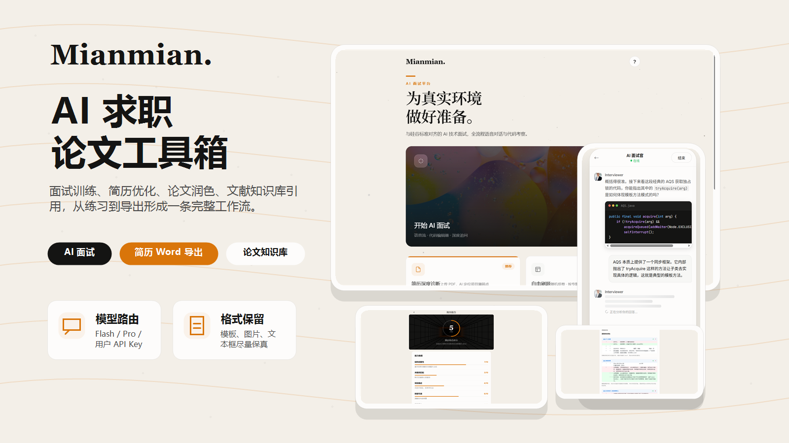
</p>

<p align="center">
  <a href="#快速开始">快速开始</a>
  ·
  <a href="#功能亮点">功能亮点</a>
  ·
  <a href="#项目截图">项目截图</a>
  ·
  <a href="#部署提示">部署提示</a>
</p>

<p align="center">
  
  
  
  
  
</p>

如果你正在找一个能落地的 AI 全栈项目，面面通不是简单的聊天壳子。它把面试训练、题库练习、简历解析优化、论文润色降重、PDF/DOCX 知识库引用、用户额度与模型路由放在同一套产品链路里，更接近真实 SaaS 项目的复杂度。

如果这个项目对你有帮助，欢迎点一个 Star。它会直接决定这个项目后续会不会继续补齐更多生产级能力。

## 为什么值得 Star

- **完整业务闭环**：从求职准备到论文处理，覆盖上传、解析、AI 生成、结果对比、导出与历史记录。
- **真实 AI 工程问题**：支持流式输出、Flash/Pro 模型切换、用户自定义 API Key、额度控制与知识库权限。
- **格式保留实践**：简历 Word 导出尽量保留模板、图片、文本框布局，避免传统替换导致版式崩坏。
- **论文知识库引用**：上传 PDF/DOCX 后提取证据片段，区分直接支持、背景相关和无关证据，降低“乱引文献”的风险。
- **前后端都可学习**：Spring Boot + MyBatis-Plus + Vue 3 + TypeScript + Pinia，适合做毕业设计、作品集或二次开发。
- **不是 Demo 页面**：包含管理员能力、用户配置、文档解析、部署 Nginx 配置、数据库迁移等真实项目细节。

## 功能亮点

<p align="center">
  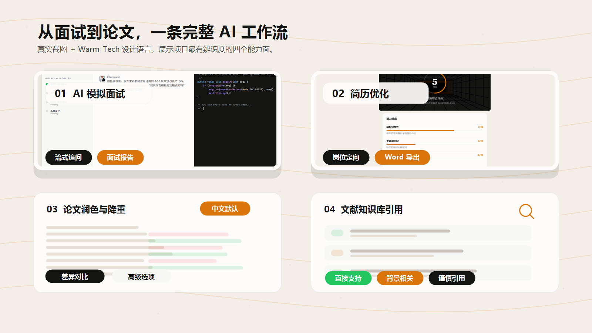
</p>

| 模块        | 能力                                                        |
| ----------- | ----------------------------------------------------------- |
| AI 模拟面试 | 多轮追问、流式回复、面试报告、得分评估、Flash/Pro 模型切换  |
| 智能题库    | 分类浏览、随机刷题、答案判分、错题本、练习统计              |
| 简历优化    | DOCX 上传解析、AI 评分、岗位定向优化、保留模板导出 Word     |
| 论文润色    | 中文/英文输出语言选项、差异对比、段落级优化、导出结果       |
| 论文降重    | AI 降重、重复表达压缩、交互式 diff 预览                     |
| 文献知识库  | PDF/DOCX 文本提取、证据片段召回、引用支持度分类、管理员授权 |
| 用户与配置  | 用户 API Key、自定义模型、额度统计、管理员开关与权限控制    |

## 项目架构

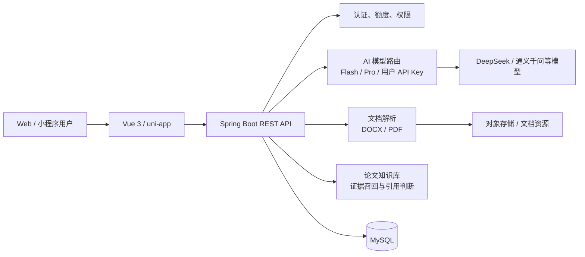

## 技术栈

| 层级     | 技术                                               |
| -------- | -------------------------------------------------- |
| 后端     | Spring Boot 3、MyBatis-Plus、MySQL、JWT、Flyway    |
| Web 前端 | Vue 3、Vite、TypeScript、Pinia、Vue Router         |
| 小程序   | uni-app、Vue 3、TypeScript、微信小程序             |
| AI 能力  | DeepSeek API、通义千问兼容接入、用户自定义 API Key |
| 文档能力 | DOCX 模板导出、PDF.js 文本解析、阿里云文档智能/OSS |
| 部署     | Nginx、静态资源托管、Spring Boot 服务              |

## 项目截图

| 首页                              | 题库                               |
| --------------------------------- | ---------------------------------- |
| 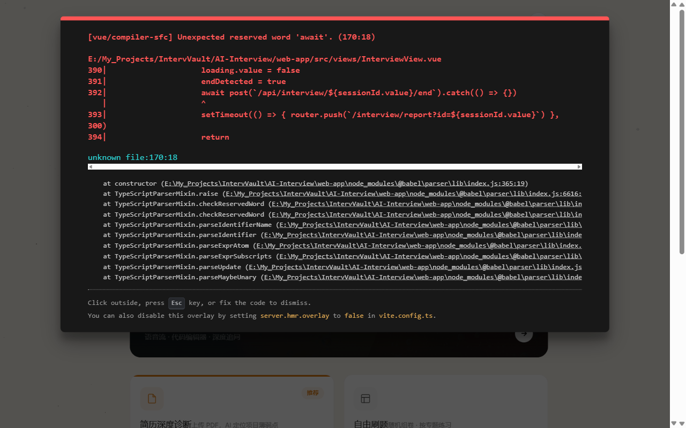 | 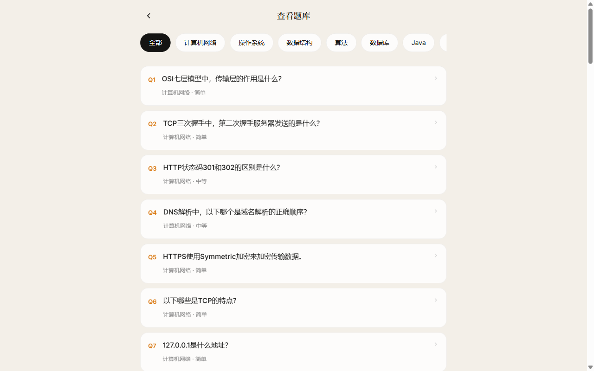 |

| 刷题练习                              | AI 面试入口                               |
| ------------------------------------- | ----------------------------------------- |
| 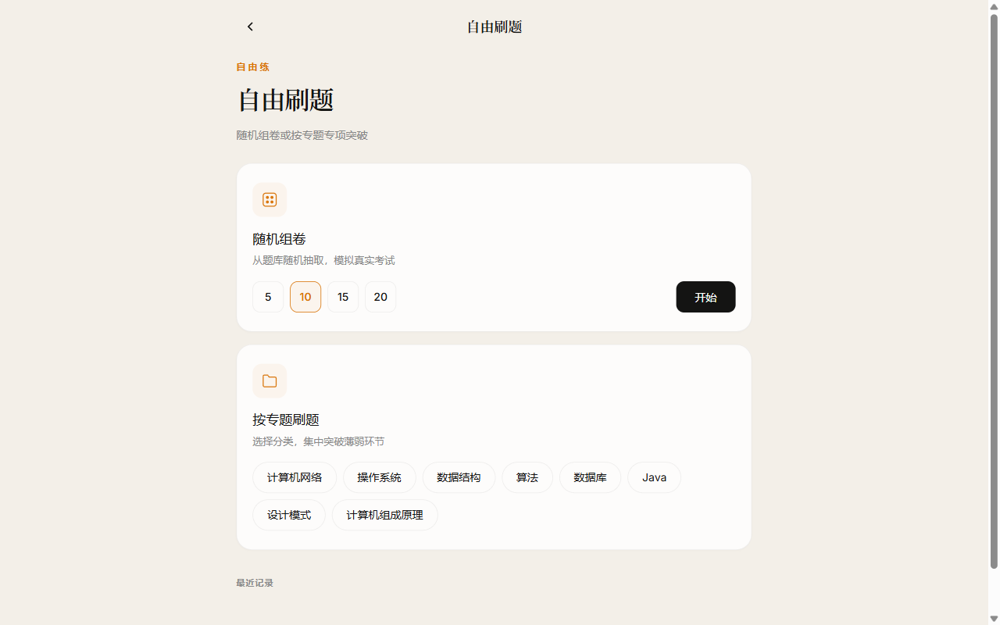 | 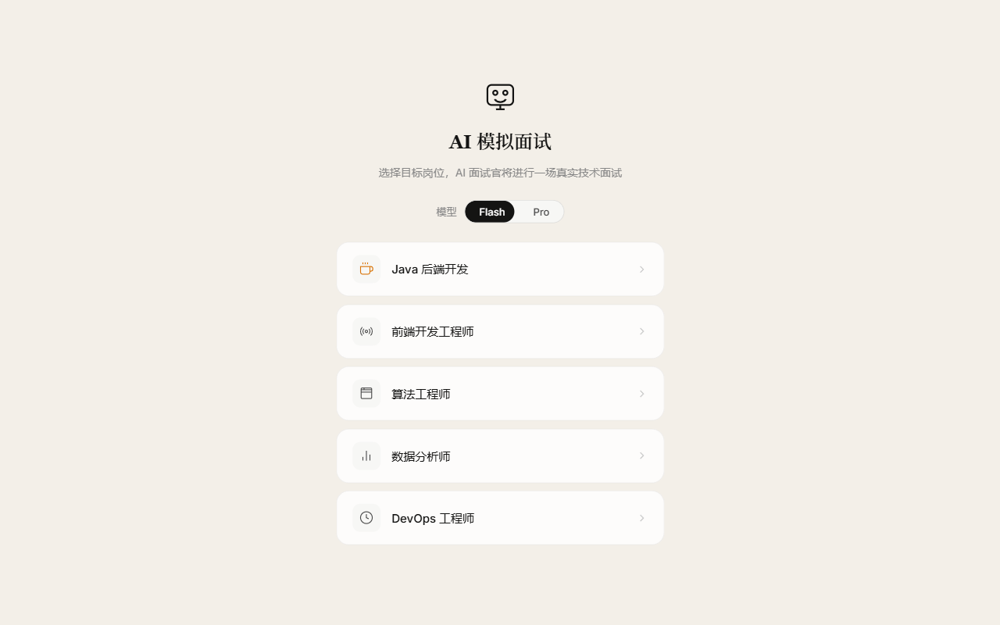 |

| 面试对话 Web                                      | 面试对话移动端                                                 |
| ------------------------------------------------- | -------------------------------------------------------------- |
| 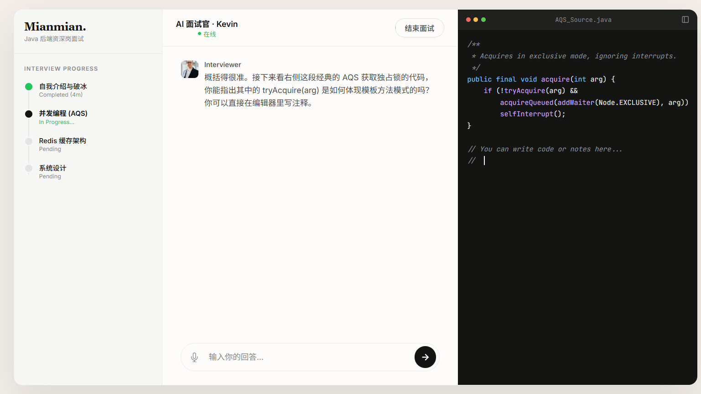 | 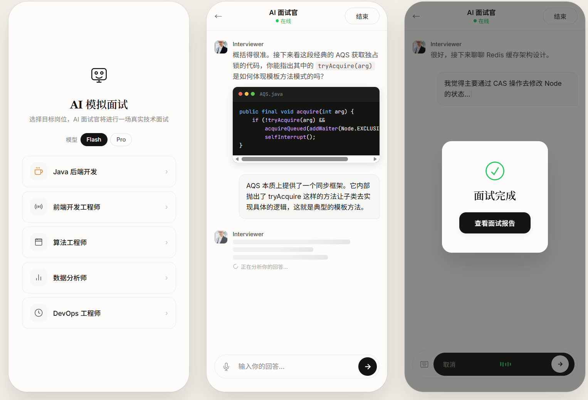 |

| 简历上传                            | 简历报告                                  |
| ----------------------------------- | ----------------------------------------- |
| 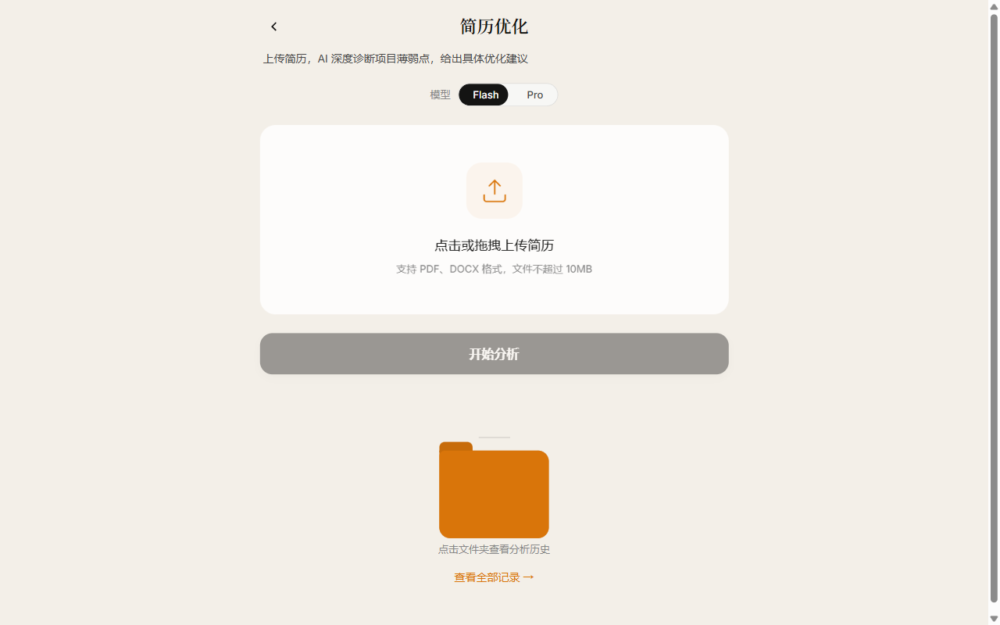 | 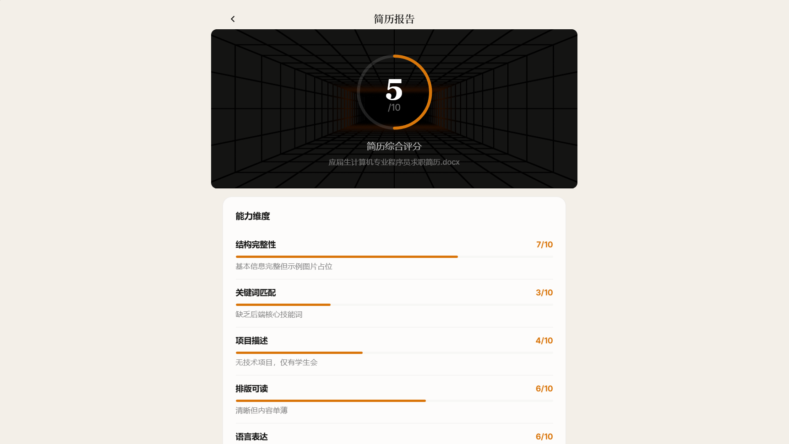 |

| 简历深度优化                                |
| ------------------------------------------- |
| 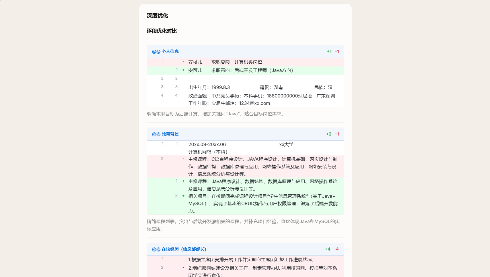 |

## 项目结构

```text
MainAI/
├── mianmiantong-server/          # Spring Boot 后端
│   └── src/main/
│       ├── java/com/mianmiantong/
│       │   ├── controller/       # REST 控制器
│       │   ├── service/          # 业务服务
│       │   ├── entity/           # 数据库实体
│       │   ├── mapper/           # MyBatis-Plus Mapper
│       │   └── config/           # 安全、过滤器、跨域等配置
│       └── resources/
│           └── db/migration/     # Flyway 迁移脚本
├── AI-Interview/                 # 小程序与 Web 前端
│   ├── pages/                    # uni-app 页面
│   └── web-app/                  # Vue 3 Web 应用
│       └── src/
│           ├── views/
│           ├── components/
│           ├── modules/
│           ├── composables/
│           └── router/
└── docs/                         # 文档与截图资源
```

## 快速开始

### 环境要求

- JDK 17+
- Maven 3.8+
- MySQL 8.0+
- Node.js 18+

### 1. 配置环境变量

复制 `.env.example` 为 `.env`，按需填写真实配置：

```env
DB_USERNAME=root
DB_PASSWORD=your-password
JWT_SECRET=your-jwt-secret
DEEPSEEK_API_KEY=sk-your-deepseek-key
ALIBABA_CLOUD_ACCESS_KEY_ID=your-aliyun-ak
ALIBABA_CLOUD_ACCESS_KEY_SECRET=your-aliyun-sk
```

### 2. 启动后端

```bash
cd mianmiantong-server
mvn spring-boot:run
```

启动后访问 Knife4j 接口文档：

```text
http://localhost:8080/doc.html
```

### 3. 启动 Web 前端

```bash
cd AI-Interview/web-app
npm install
npm run dev
```

默认访问：

```text
http://localhost:5173
```

### 4. 启动小程序

使用 HBuilderX 打开 `AI-Interview` 目录，选择运行到微信开发者工具。

## 核心接口

| 端点                            | 方法    | 说明               |
| ------------------------------- | ------- | ------------------ |
| `/api/auth/login`               | POST    | 用户登录           |
| `/api/interview/start`          | POST    | 开始 AI 面试       |
| `/api/interview/list`           | GET     | 面试历史           |
| `/api/questions`                | GET     | 题库列表           |
| `/api/questions/random`         | GET     | 随机抽题           |
| `/api/answers`                  | POST    | 提交答案并判分     |
| `/api/resume/upload`            | POST    | 上传简历           |
| `/api/resume/{id}/analyze-deep` | POST    | 简历深度优化       |
| `/api/resume/{id}/export-word`  | GET     | 导出 Word 简历     |
| `/api/paper-kb/evidence`        | POST    | 文献知识库证据判断 |
| `/api/user/ai-config`           | GET/PUT | 用户 AI 配置       |
| `/api/user/quota`               | GET     | 用户额度与权限     |

## 部署提示

- 前端生产构建：

```bash
cd AI-Interview/web-app
npm run build
```

- 如果部署到 Nginx，确保 `.mjs` 资源以 JavaScript MIME 返回，PDF.js worker 依赖该配置：

```nginx
location ~* \.mjs$ {
    types { application/javascript mjs; }
    try_files $uri =404;
    expires 30d;
    add_header Cache-Control "public, immutable";
}
```

- 数据库迁移建议开启 Flyway。若当前环境关闭了 `spring.flyway.enabled`，需要手动执行 `mianmiantong-server/src/main/resources/db/manual/` 中对应 SQL。
- 知识库功能默认仅对已配置个人 API Key 或管理员授权的用户开放，避免普通用户误触高成本能力。

## Roadmap

- [ ] 完善论文知识库的向量检索与引用溯源
- [ ] 增强 Word 模板保真导出，覆盖更多复杂文本框与表格布局
- [ ] 增加更多面试岗位模板和评估维度
- [ ] 增加管理员成本看板与模型调用审计
- [ ] 补充 Docker Compose 一键部署

## 适合谁

- 想学习 AI 应用工程化的开发者
- 需要毕业设计、课程设计或作品集项目的同学
- 想参考 Spring Boot + Vue 3 全栈架构的人
- 正在做求职、简历、论文、知识库类产品的团队

## 许可

本项目仅供学习研究使用，禁止商业使用。详见 [LICENSE](LICENSE)。

## 作者

chidaobuchidao

## 博客

[qiandaos.top](https://qiandaos.top)
